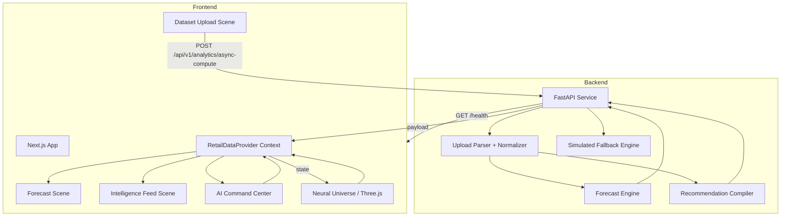

# RetailOS AI

An immersive retail intelligence platform that transforms dataset ingestion into actionable demand forecasting, live AI signals, and cinematic analytics.

---

## Vision

RetailOS AI is designed for teams who need fast, reliable retail signals from real business data. It unifies dataset ingestion, automated forecasting, and AI-driven command workflows into a single operational layer.

### Hero capabilities

- Predictive revenue forecasting from uploaded retail datasets
- Automated CSV / XLSX / JSON ingestion with schema normalization
- Live AI Command Center for slash-commands and natural language probing
- Cinematic neural 3D visualization powered by Three.js
- Recharts-based forecast and historical analytics
- Backend intelligence engine built on FastAPI with adaptive model simulation

### Screenshots

- 
- 
- 
- 
- 

---

## What is RetailOS AI?

RetailOS AI is a retail intelligence platform delivering a production-grade interface for dataset ingestion, forecasting, and business-focused insight generation.

It is built around actual implemented functionality:

- **Retail Intelligence Platform:** A web app with an operational command shell, live telemetry strip, and immersive experience pages.
- **Forecasting Engine:** A backend forecasting model that ingests normalized revenue signals, calculates trend-based projections, and applies weekday seasonality multipliers.
- **AI Insight Generation:** A command center and signal feed that synthesize recommendation payloads, category and region analysis, and time-series summaries.
- **Demand Prediction:** A forecast pipeline built from the last 14 days of revenue history with trend estimation and confidence bands.
- **Dataset Ingestion:** A robust upload engine that accepts CSV, TSV, XLSX, JSON, and even media/document payloads with graceful fallback simulation.
- **Business Intelligence Layer:** Category ranking, regional breakdowns, margin estimates, and actionable recommendations are surfaced in the UI.

---

## Key Features

| Feature | Description | Status |
|---|---|---|
| CSV Ingestion | Client-side validation and backend upload transform retail data into normalized signals | Implemented |
| Forecast Engine | Revenue projection using recent trend, baseline, and weekday multipliers | Implemented |
| AI Command Center | Interactive slash-command agent with live/demo response routing | Implemented |
| Neural Universe | 3D scene built with React Three Fiber and adaptive performance tiers | Implemented |
| Telemetry Panel | System health strip with backend health checks, FPS tier and upload latency | Implemented |
| Health Monitoring | Backend /health endpoint and frontend live status polling | Implemented |
| Dataset Validation | Schema heuristic validation for date and revenue columns | Implemented |
| Trend Detection | Category and region ranking surfaced via recommendation payloads | Implemented |
| Signal Stream | Intelligence feed with dynamic signal cards and typewriter effect | Implemented |
| Forecast Visualization | Recharts area charts with confidence bands and interactive drilldowns | Implemented |

---

## System Architecture



---

## Technology Stack

### Frontend

- **Next.js 14** — App Router architecture for page-based experiential flows.
- **React 18** — Modern component model and concurrent rendering support.
- **Framer Motion** — Cinematic transitions, interactive UI motion, loader states, and command-drawer animations.
- **React Three Fiber / Drei** — Immersive 3D neural universe with orbital product nodes and adaptive rendering.
- **Recharts** — Forecast charting with area series, custom tooltip overlays, and interactive point drills.
- **React Dropzone + PapaParse** — Client-side file ingestion and schema validation.

### Backend

- **FastAPI** — High-performance upload API with built-in OpenAPI docs.
- **Uvicorn** — ASGI server for low-latency dataset compute.
- **OpenPyXL** — Excel ingestion for `.xlsx`, `.xls`, `.xlsm`, and `.xlsb` payloads.
- **Python standard library** — CSV parsing, date normalization, and statistics.

### Data Processing

- **Structured normalization** — Revenue rows are normalized into a common schema for category, region, product, margin, and date.
- **Forecasting logic** — Last-14-day baseline, linear trend, and weekday weighting produce 90-day projections.
- **Fallback simulation** — Document/media uploads generate synthetic intelligence payloads when structured data cannot be parsed.

### Visualization

- **Recharts area charts** — Forecast and historical revenue series with glow gradients and confidence band rendering.
- **Three.js visual logic** — Particle cloud, orbital rings, and trade category nodes animate in the neural dashboard.

### Infrastructure

- **Docker Compose** — Orchestrates frontend, backend, and Redis cache coordinator.
- **Backend CORS config** — Environment-based allowed origins via `ALLOWED_ORIGINS`.
- **Health endpoint** — `/health` for availability checks.

---

## Project Structure

```text
/
├── backend/
│   ├── Dockerfile
│   ├── main.py
│   ├── predict.py
│   ├── requirements.txt
│   └── .env.example
├── frontend/
│   ├── Dockerfile
│   ├── app/
│   │   ├── layout.jsx
│   │   ├── page.jsx
│   │   ├── login/page.jsx
│   │   └── experience/
│   │       ├── dataset/page.jsx
│   │       ├── forecast/page.jsx
│   │       └── intelligence/page.jsx
│   ├── components/
│   │   ├── foundation/
│   │   │   ├── CinematicNav.jsx
│   │   │   ├── SystemHealthBar.jsx
│   │   │   ├── SmoothScrollProvider.jsx
│   │   │   └── EnvironmentEngine.jsx
│   │   └── scenes/
│   │       ├── AICommandCenter.jsx
│   │       ├── AICommandAgentDrawer.jsx
│   │       ├── DatasetUploadScene.jsx
│   │       ├── ForecastScene.jsx
│   │       ├── IntelligenceFeedScene.jsx
│   │       └── NeuralUniverse.jsx
│   ├── lib/
│   │   ├── retailContext.js
│   │   ├── usePerformanceTier.js
│   │   ├── useKeyboardShortcuts.js
│   │   └── theme.js
│   ├── next.config.mjs
│   ├── package.json
│   └── jsconfig.json
├── docker-compose.yml
├── generate_dataset.py
├── retail_synthetic_dataset.csv
└── README.md
```

### Folder responsibilities

- `backend/` — hosting the FastAPI ingestion API, parser, forecast logic, and fallback simulation.
- `frontend/app/` — page router for home, dataset ingestion, forecast visualization, and intelligence feed.
- `frontend/components/` — reusable cinematic UI systems, neural scenes, and command interfaces.
- `frontend/lib/` — shared state, telemetry hooks, and performance utilities.
- `docker-compose.yml` — container topology for frontend, backend, and Redis.

---

## Data Flow

1. **CSV Upload** — The frontend accepts CSV / XLSX / JSON / media files in `DatasetUploadScene`.
2. **Validation** — `CSVUploadValidator` runs schema checks for date and revenue indicators using PapaParse.
3. **Parsing** — The backend parses structured files with `csv`, `openpyxl`, or JSON loaders.
4. **Normalization** — Rows normalize to `order_date`, `category`, `region`, `product`, `revenue`, `quantity_sold`, `margin`.
5. **Forecast Generation** — `main.py` computes daily revenue series, projects 90-day forecasts, and applies bounds.
6. **Context Update** — `RetailDataProvider` receives `reportData`, toggles live mode, records latency, and stores logs.
7. **UI Visualization** — ForecastScene renders Recharts graphs and metrics, while IntelligenceFeedScene shows live signal cards.
8. **AI Insights** — The command agent and recommendation payloads surface category, region, and action-level insights.

---

## Forecasting Engine

RetailOS AI uses a lightweight, explainable forecasting pipeline implemented in `backend/main.py` and `backend/predict.py`.

- **Inputs:** normalized daily revenue series derived from uploaded retail rows.
- **Logic:** mean baseline of the last 14 days, linear trend, and weekday weight adjustments.
- **Outputs:** 90-day forecast timeline, lower/upper bounds, projected monthly revenue, peak day forecast, and gross margin percentage.
- **Metrics:** `current_revenue`, `revenue_change_percent`, `projected_monthly_revenue`, `peak_day_forecast`, `gross_margin_percent`, `top_category`.
- **Recommendations:** category driver, regional allocation signal, campaign timing guidance.

The forecasting engine is intentionally transparent: it models momentum using recent performance and weekday seasonality rather than a black-box ML model.

---

## AI Command Center

The AI Command Center is a local intelligence shell that operates in two modes:

- **Demo mode** — synthetic retail probes and scripted intelligence responses.
- **Live mode** — responses are routed against uploaded `reportData`.

Supported commands include:

- `/help` — lists active command routes.
- `/status` — returns operating mode and ingestion status.
- `/metrics` — summarizes category and portfolio performance.
- `/forecast` — surfaces the forecast peak and demand anchor.
- `/inventory` — emits inventory and reorder signals.
- `/insights` — returns AI-generated recommendation summaries.
- `/clear` — flushes the drawer conversation.

The agent also supports natural language heuristics for revenue, category, recommendations, and mode introspection.

---

## Telemetry & Observability

RetailOS AI includes built-in observability features:

- **System Health Bar** — live core status, mode, dataset file name, upload latency, and measured FPS tier.
- **Backend health polling** — frontend polls `/health` every 8 seconds.
- **Upload latency tracking** — real round-trip latency is captured during each ingestion.
- **Event log viewer** — recent system events are recorded in `RetailDataProvider`.
- **WebSocket telemetry hook** — `frontend/src/hooks/useTelemetry.js` provides a reconnecting stream interface for future event pipelines.

---

## Installation

### Backend setup

```bash
cd backend
python -m venv .venv
.venv\Scripts\Activate.ps1
pip install -r requirements.txt
```

### Frontend setup

```bash
cd frontend
npm install
```

### Environment variables

Create `backend/.env` from `backend/.env.example` if you want to override CORS origins.

```env
ALLOWED_ORIGINS=http://localhost:5173
```

### Run locally

```bash
# Start backend
cd backend
.venv\Scripts\Activate.ps1
uvicorn main:app --host 127.0.0.1 --port 8000 --reload

# Start frontend
cd frontend
npm run dev
```

Then open `http://127.0.0.1:5173`.

### Production build

```bash
cd frontend
npm run build
npm run start
```

### Docker Compose

```bash
docker compose up --build
```

This brings up:
- `frontend` on port `80`
- `backend` on port `8000`
- `cache_coordinator` (Redis) as infrastructure support

---

## Performance Optimizations

- **Lazy loading** — 3D canvas is dynamically imported to avoid SSR cost.
- **Adaptive rendering** — `usePerformanceTier` scales particles, DPR, and scene detail based on measured FPS.
- **GPU-friendly animations** — Framer Motion uses opacity, translate, and scale instead of expensive layout changes.
- **Progressive data loading** — chart slices and forecast horizons are rendered in controlled batches.

---

## Accessibility

- **Keyboard shortcuts:** `Ctrl+K` / `Cmd+K` toggles the AI drawer, `Escape` closes overlays.
- **Focus management:** command drawer and login flows support visible focus.
- **Reduced motion friendly** — animation state is mitigated through component-level timing and passive visual transitions.

---

## Future Roadmap

- Replace the rule-based forecast model with a stateless ML model or time-series library.
- Add persistent dataset storage and reporting into PostgreSQL or another analytical store.
- Activate the `useTelemetry` WebSocket hook for real-time pipeline updates.
- Add multi-tenant dataset access and user workspace isolation.
- Introduce voice commands and natural-language assistant workflows.
- Expand anomaly detection for inventory, price elasticity, and channel-level risk.

---

## Author

RetailOS AI is engineered as a portfolio-grade project with a product-first architecture, cinematic brand, and measurable analytics flows.

The repository combines modern frontend motion, immersive 3D visualization, backend dataset intelligence, and a strong operational foundation.
